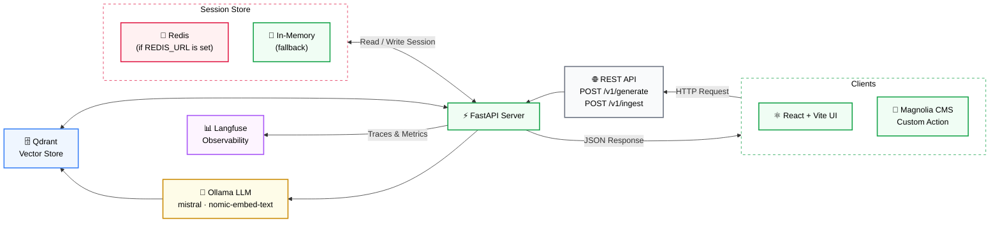

# Magnolia Groovy Generator

A RAG-powered web app for generating Magnolia CMS Groovy scripts using natural language prompts.

Live Site: [mgnl-groovy-generator-app](https://mgnl-groovy-generator-app.vercel.app/)


[▶ Watch Demo](https://drive.google.com/file/d/1pTJBK1EGd-dfmM8mIvov_rrAEOrY8xE7/view?usp=sharing)

## Overview

Magnolia Groovy Generator is a full-stack portfolio project that combines a FastAPI backend with a React + Vite frontend to generate context-aware Groovy scripts for Magnolia CMS. It uses Retrieval-Augmented Generation (RAG) to ground script generation on a curated set of example scripts, ensuring outputs are accurate and idiomatic.


## Tech Stack

| Layer | Technology |
|---|---|
| Frontend | React, Vite, Tailwind CSS |
| Backend | FastAPI, Python |
| LLM & Embeddings | Ollama (`mistral`, `nomic-embed-text`, `qwen3.5`) |
| Vector Store | Qdrant |
| RAG Framework | LlamaIndex |
| CMS Integration | Magnolia CMS |
| Observability | LangFuse |
| Memory | Redis |

## Architecture



## Features

- Natural language to Groovy script generation
- RAG pipeline grounded on example Magnolia CMS scripts
- Expected properties input — tag-based field to guide script output
- Input guard rails — blocks non-Groovy and modification requests, if disabled (default)
- Output guard rails — validates and sanitizes generated scripts
- Retry logic — automatically retries if output contains unwanted content
- Rate limiting — 1 request per second per client
- Fully local — runs entirely on your machine with no cloud API required
- Session Memory - remembers session requests to refine succeeding queries


## Prerequisites

- Python 3.11+
- Node.js 18+
- [Ollama](https://ollama.com) installed and running


## Getting Started

### 1. Clone the repository

```bash
git clone https://github.com/kirkalyn13/mgnl-groovy-generator-app
cd mgnl-groovy-generator-app
```

### 2. Set up environment variables

```bash
cp .env.example .env
```

Edit `.env`:

```env
API_URL="http://localhost:8000"
API_DOCS_PATH="/docs"
```

### 3. Start the frontend

```bash
cd mgnl-groovy-generator-app
npm install
npm run dev
```

Open [http://localhost:5173](http://localhost:5173) in your browser.

## Run with Docker

```bash
docker build -t magnolia-rag-frontend .
docker run -p 5173:5173 magnolia-rag-frontend
```

## Authors

- [Engr. Kirk Alyn Santos](https://github.com/kirkalyn13)

## License

MIT